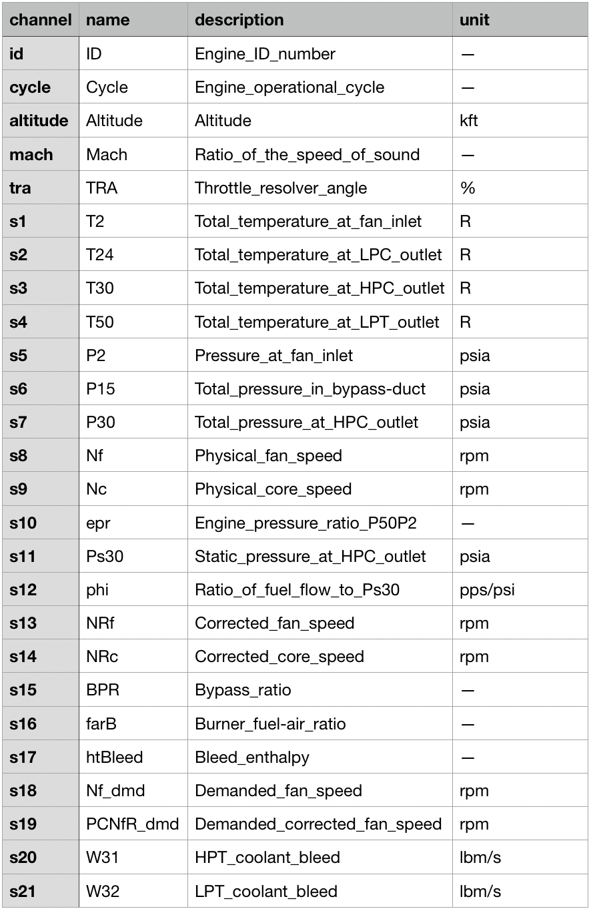

# Predictive Maintenance Project: Simulated Turbofan Engines Data

## Executive Summary
Predictive maintenance aims to increase system reliability and be more cost efficient than time-based only preventive maintenance. This project focused on estimating the “remaining useful life (RUL)” of a machine, more specifically in this case of aircraft turbofan engines whose dataset used was from a NASA competition where simulated turbofan engines signals were provided.

Several machine learning models (Elastic Net, Random Forest, Gradient Boosting, Logistic Regression, SVM, Neural Network, among others) were tuned and compared to predict a failure occurrence. Results were improved by using feature engineering (moving average window), feature normalisation by operating regime and modelling gridsearch. Neural Network, Gradient Boosting and SVR models showed the best performances.

This was an individual project was developed during the Data Science course at General Assembly London.

## Data

The data used in this project was made available by NASA:
Turbofan Engine Degradation Simulation Data Set (https://ti.arc.nasa.gov/tech/dash/groups/pcoe/prognostic-data-repository/#turbofan).

	

